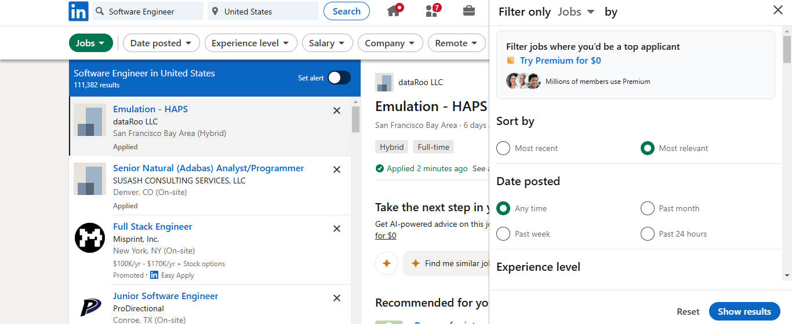
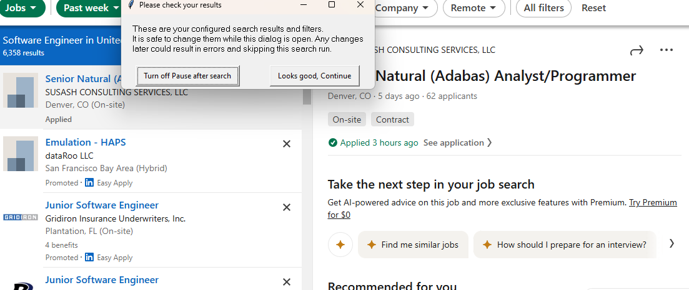
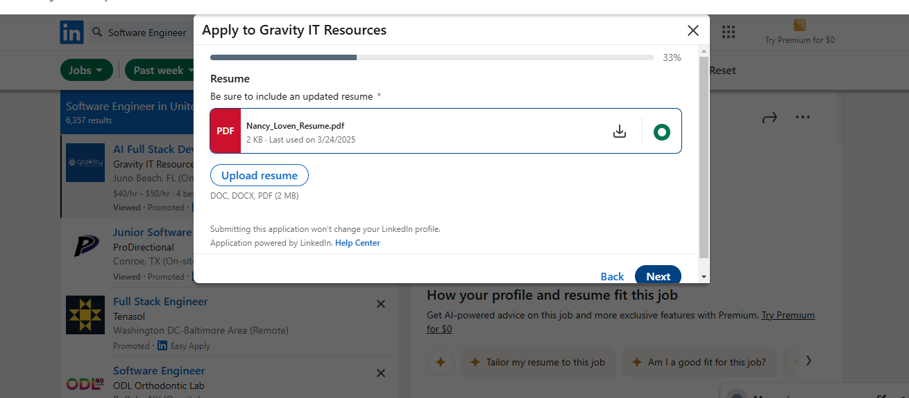

# LinkedIn Auto Apply & Resume Generator

## 📌 Project Overview
This tool automates the job application process on **LinkedIn** by scraping job listings, filling out application forms, and generating tailored resumes based on job descriptions. It can apply to **100+ jobs in less than an hour** while ensuring AI-powered resume customization.

---

## 📸 Sample Output

### Searching & Filtering


---

### Ready to Apply Button


---

### Uploading Resume & Answering Questions


---


## 🚀 Features
- **Automated LinkedIn Job Applications**
- **AI-Based Resume Customization**
- **Smart Form Filling & Auto Answers**
- **Job Filtering Based on Preferences**
- **Stealth Mode to Bypass Detection**
- **Saves Job History & Logs for Tracking**

---

## 🛠️ Installation Guide
1. Install [Python 3.10+](https://www.python.org/downloads/)
2. Install required dependencies:
   ```sh
   pip install undetected-chromedriver pyautogui setuptools openai
   ```
3. Download & install [Google Chrome](https://www.google.com/chrome)
4. Clone the repository:
   ```sh
   git clone https://github.com/Emi-codecraft/LinkedIn_auto_apply_resume_generator.git
   ```
5. Run the script:
   ```sh
   python Linkedin_Auto.py
   ```

---


## 🔧 Configuration Guide
1. **Edit `config/personals.py`** → Add personal details (name, phone, email, etc.)
2. **Edit `config/questions.py`** → Customize auto-answers for applications
3. **Edit `config/search.py`** → Set job filters (location, keywords, salary, etc.)
4. **Edit `config/secrets.py`** → Add LinkedIn credentials & OpenAI API key (optional)
5. **Run the bot and let it apply automatically!**

---

## 📂 Folder Structure
```
LinkedIn_auto_apply_resume_generator/
│── config/                  # Configuration files (settings, questions, secrets)
│── modules/                 # Core automation scripts
│── logs/                    # Application history & logs
│── Linkedin_Auto.py             # Main script to start the bot
│── README.txt               # Project documentation
```

---
## Additional tips
 After running open_chrome.py, if the Chrome driver version is compatible and the searching process successfully detects the Easy Apply button, a pop-up message will be displayed:

"Looks good, continue" [Button]

👉 You must click this button to proceed.
👉 If you do not click it, the Apply process will not start and will remain in the same state.

🚀 Click the button to begin the application process!
 
---

## 🤝 Contributing
We welcome contributions! If you'd like to improve the tool:
- Fork the repository & submit a pull request.
- Follow the project's coding & documentation guidelines.

---

## ⚖️ License
This project is licensed under **GNU AGPL-3.0**.

---

## 📩 Contact
- **GitHub:** [Emi-codecraft](https://github.com/Emi-codecraft)
- **LinkedIn:** [Emimaal Samuvelraj](https://www.linkedin.com/in/emimaal-samuvelraj-02952127a/)
- **Email:** emimaals2@gmail.com

🚀 **Star the repository if you find this useful!**

